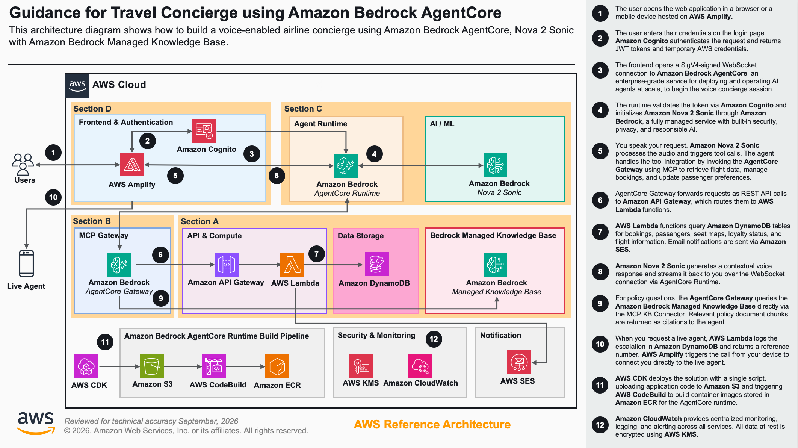

# Guidance for Travel Concierge using Amazon Bedrock AgentCore and Nova Sonic 2

## Table of Contents

1. [Overview](#overview)
    - [User request flow](#user-request-flow)
    - [Cost](#cost)
    - [Sample Cost Table](#sample-cost-table)
2. [Prerequisites](#prerequisites)
    - [Operating System](#operating-system)
    - [Third-party tools](#third-party-tools)
    - [AWS account requirements](#aws-account-requirements)
    - [AWS CDK bootstrap](#aws-cdk-bootstrap)
    - [Supported Regions](#supported-regions)
3. [Automated Deployment](#automated-deployment)
4. [Manual Deployment](#manual-deployment)
5. [Deployment Validation](#deployment-validation)
6. [Running the Guidance](#running-the-guidance)
7. [Next Steps](#next-steps)
8. [Cleanup](#cleanup)
9. [Notices](#notices)
10. [FAQ, Known Issues, Additional Considerations, and Limitations](#faq-known-issues-additional-considerations-and-limitations)
11. [Revisions](#revisions)
12. [Authors](#authors)

## Overview

This Guidance demonstrates how to build an AI-powered voice travel concierge for airlines that enables customers to manage their flights, seats, meals, and travel preferences through natural voice conversation. Customers speak their requests and the system handles the rest — no screens, no typing, no tapping. The Guidance addresses the growing demand for personalized, hands-free travel assistance by combining real-time speech-to-speech AI with a decoupled, scalable backend architecture.

The Guidance uses **Amazon Bedrock AgentCore** for agent hosting with microVM session isolation, **Amazon Nova 2 Sonic** for bidirectional speech-to-speech processing, the **Strands Agents** framework for conversational agent logic, **Amazon Bedrock Knowledge Base** backed by **Amazon S3 Vectors** for airline policy queries, and **Model Context Protocol (MCP)** for standardized tool interactions between the agent and backend services. All infrastructure is deployed using **AWS Cloud Development Kit (AWS CDK)**.

The architecture implements a four-section decoupled pattern:



**Section A — Backend Infrastructure.** Five CDK stacks deploy the airline backend: **Amazon DynamoDB** tables for customer profiles, bookings, passengers, seat maps, purchase history, preferences, conversations, and flight status; **Amazon Bedrock Knowledge Base** backed by **Amazon S3 Vectors** for airline policy documents; **AWS Lambda** functions for business logic; **Amazon API Gateway** REST endpoints with **AWS Identity and Access Management (IAM)** authorization; and **Amazon Cognito** for user authentication with User Pool, Identity Pool, and an initial test user.

**Section B — AgentCore Gateway.** A CDK stack creates the **Amazon Bedrock AgentCore Gateway** with MCP protocol, exposing all backend API endpoints as discoverable MCP tools that the agent can invoke by name.

**Section C — AgentCore Runtime.** Two CDK stacks provision **Amazon Elastic Container Registry (Amazon ECR)** for container storage, **Amazon Simple Storage Service (Amazon S3)** for source uploads, **AWS CodeBuild** for ARM64 Docker builds, and the **Amazon Bedrock AgentCore Runtime** with WebSocket protocol. The agent uses the Strands Agents framework with Amazon Nova 2 Sonic for bidirectional voice streaming.

**Section D — Frontend.** A CDK stack creates an **AWS Amplify** application for hosting the React frontend. After the stack deploys, the frontend code is built and pushed to Amplify.

### User request flow

1. The user opens the web application in a browser or a mobile device hosted on **AWS Amplify**. 
2. The user enters their credentials on the login page. **Amazon Cognito** authenticates the request and returns JWT tokens and temporary AWS credentials.
3. The frontend opens a SigV4-signed WebSocket connection to **Amazon Bedrock AgentCore** to begin the voice concierge session.  
4. The runtime validates the token via **Amazon Cognito** and initializes **Amazon Nova 2 Sonic** through **Amazon Bedrock**.
5. You speak your request. **Amazon Nova 2 Sonic** processes the audio and triggers tool calls. The agent handles the tool integration by invoking the AgentCore Gateway using MCP to retrieve flight data, manage bookings, and update passenger preferences. 
6. **Amazon Bedrock AgentCore Gateway** forwards requests as REST API calls to **Amazon API Gateway**, which routes them to **AWS Lambda** functions.
7. **AWS Lambda** functions query **Amazon DynamoDB** tables for bookings, passengers, seat maps, loyalty status, and flight information. Email notifications are sent via **Amazon SES**.
8. **Amazon Nova 2 Sonic** generates a contextual voice response and streams it back to you over the WebSocket connection via **Amazon Bedrock AgentCore Runtime**.
9. For policy questions, **AWS Lambda** invokes the **Amazon Bedrock Knowledge Base** (Managed KB) which retrieves relevant airline policy excerpts from uploaded PDF documents and returns a grounded natural language answer.
10. When you request a live agent, **AWS Lambda** logs the escalation in **Amazon DynamoDB** and returns a reference number. **AWS Amplify** then triggers the call from your device to connect you to the live agent. 
11. **AWS CDK** deploys the solution with a single script, uploading application code to **Amazon S3** and triggering **AWS CodeBuild** to build container images stored in **Amazon ECR** for the AgentCore runtime.
12. **Amazon CloudWatch** provides centralized monitoring, logging, and alerting across all services. All data at rest is encrypted using **AWS KMS**.

### Cost

You are responsible for the cost of the AWS services used while running this Guidance. As of May 2026, the cost for running this Guidance with the default settings in the US East (N. Virginia) Region is approximately $124 per month for processing 3,000 voice sessions across a single airline deployment.

We recommend creating a [Budget](https://docs.aws.amazon.com/cost-management/latest/userguide/budgets-managing-costs.html) through [AWS Cost Explorer](https://aws.amazon.com/aws-cost-management/aws-cost-explorer/) to help manage costs. Prices are subject to change. For full details, refer to the pricing webpage for each AWS service used in this Guidance.

### Sample Cost Table

The following table provides a sample cost breakdown for deploying this Guidance with the default parameters in the US East (N. Virginia) Region for one month. Estimates assume 3,000 voice sessions per month with an average of 5 minutes each and do not account for AWS Free Tier benefits.

| AWS service | Dimensions | Cost [USD] |
| ----------- | ---------- | ---------- |
| [Amazon Bedrock (Nova 2 Sonic)](https://aws.amazon.com/nova/pricing/) | ~680 input + ~5,083 output speech tokens/session, ~7,438 input + ~1,260 output text tokens/session | $68.96 |
| [Amazon Bedrock AgentCore Runtime](https://aws.amazon.com/bedrock/agentcore/pricing/) | 3,000 sessions, ~5 min each, ~30% active CPU, 1 vCPU, 512 MB memory | $7.88 |
| [Amazon Bedrock AgentCore Gateway](https://aws.amazon.com/bedrock/agentcore/pricing/) | 3,000 search calls + 60,000 tool invocations, 17 tools indexed | $0.35 |
| [Amazon Bedrock Knowledge Base](https://aws.amazon.com/bedrock/pricing/) | S3 Vectors storage, ~3,000 queries/month | $5.00 |
| [Amazon Cognito](https://aws.amazon.com/cognito/pricing/) | 1,000 monthly active users | $5.50 |
| [AWS Lambda](https://aws.amazon.com/lambda/pricing/) | 60,000 invocations, 256 MB, ~1 s average duration | $0.50 |
| [Amazon API Gateway](https://aws.amazon.com/api-gateway/pricing/) | 60,000 REST API calls | $0.21 |
| [Amazon DynamoDB](https://aws.amazon.com/dynamodb/pricing/) | 8 tables, on-demand, ~60,000 reads + ~10,000 writes | $0.05 |
| [Amazon SES](https://aws.amazon.com/ses/pricing/) | ~3,000 email notifications/month | $0.30 |
| [AWS Amplify](https://aws.amazon.com/amplify/pricing/) | Hosting: 5 GB storage, 15 GB bandwidth | $0.50 |
| [Amazon CloudWatch](https://aws.amazon.com/cloudwatch/pricing/) | Logs and metrics for all services | $5.00 |
| | **Estimated Total** | **~$94.25** |

**Notes:**
- Nova 2 Sonic output speech tokens are the dominant cost driver (~73% of total).
- Token counts are based on observed metrics from real travel concierge conversations with tool calls.
- AgentCore Runtime uses consumption-based pricing — you pay only for active CPU and memory, not I/O wait time.
- Costs scale linearly with usage. For 10,000 sessions per month, the estimated cost is approximately $314.

## Prerequisites

### Operating System

These deployment instructions are optimized to best work on **Amazon Linux 2023**. Deployment on macOS or other Linux distributions may require additional steps.

- [AWS account](https://signin.aws.amazon.com/signin) with administrator access or sufficient permissions to create the resources listed in this Guidance

### Third-party tools

Install the following tools before deployment:

- [Node.js](https://nodejs.org/) 20.x or later (required for AWS CDK deployment and Lambda functions)
- [Python](https://www.python.org/downloads/) 3.12+ (required for synthetic data seeding and test client)
- [AWS Command Line Interface (AWS CLI)](https://docs.aws.amazon.com/cli/latest/userguide/getting-started-install.html) 2.x configured with credentials
- [AWS CDK CLI 2.x](https://docs.aws.amazon.com/cdk/v2/guide/getting-started.html): `npm install -g aws-cdk` (required for infrastructure deployment)
- CDK bootstrapped in your target account/region: `npx cdk bootstrap`

### AWS account requirements

- IAM permissions to deploy CDK stacks and CloudFormation templates, create and manage Bedrock AgentCore Runtimes and Gateways, configure Cognito User Pools and Identity Pools, create Lambda functions and API Gateway endpoints, and set up DynamoDB tables and Bedrock Knowledge Base resources.
- Amazon Bedrock model access for **Amazon Nova 2 Sonic**. Request access through the [Amazon Bedrock console](https://console.aws.amazon.com/bedrock/) if not already enabled.
- Amazon Bedrock model access for **Amazon Titan Embed Text v2** (required for the Knowledge Base embedding model).
- Access to the following services: Amazon Bedrock AgentCore Runtime, Amazon Bedrock (Nova 2 Sonic, Titan Embed), Amazon Bedrock Knowledge Base, AWS Lambda, Amazon DynamoDB, Amazon Cognito, AWS Amplify, Amazon API Gateway, Amazon ECR, Amazon S3, AWS CodeBuild, Amazon SES, and Amazon CloudWatch.

### AWS CDK bootstrap

If you are using AWS CDK for the first time, bootstrap your account and Region:

```bash
npx cdk bootstrap aws://<ACCOUNT_ID>/<REGION>
```

Replace `<ACCOUNT_ID>` with your AWS account ID and `<REGION>` with your target Region (for example, `us-east-1`).

### Supported Regions

This Guidance requires Amazon Bedrock model access for Amazon Nova 2 Sonic. Deploy in a Region where Nova 2 Sonic is available. Check the [Amazon Bedrock pricing page](https://aws.amazon.com/bedrock/pricing/) for current Region availability.

## Automated Deployment

For automated deployment, a one-click deploy script (`deploy-all.sh`) is available. This script automates all deployment steps including dependency installation, resource creation, and validation.

**Usage:**

```bash
# Clone the repository
git clone https://github.com/aws-samples/sample-travel-concierge-with-amazon-bedrock-agentcore-and-nova-sonic
cd sample-travel-concierge-with-amazon-bedrock-agentcore-and-nova-sonic

# Make the script executable and run it
chmod +x deploy-all.sh
./deploy-all.sh \
  --user-email your-email@example.com \
  --user-name "Your Name" \
  --company-name "SkyWave Airlines" \
  --support-phone "+18005551234"
```

**Required parameters:**
- `--user-email` — A valid, accessible email address. Amazon Cognito sends a temporary password to this address during deployment.
- `--user-name` — Full name for the test user profile.

**Optional parameters:**
- `--company-name` — Airline brand name (for example, `"SkyWave Airlines"`). When set, the agent is branded for that airline.
- `--support-phone` — Support phone number for live agent escalation (for example, `"+18005551234"`).
- `--with-synthetic-data` — Seed the database with sample customers, bookings, and flight data (non-interactive).
- `--with-frontend` — Deploy the React frontend to AWS Amplify (non-interactive).
- `--skip-synthetic-data` — Skip synthetic data seeding.
- `--skip-frontend` — Skip frontend deployment.
- `--mode fresh` — Clean redeploy from scratch.

**What the script does:**
- Checks all prerequisites (Node.js, Python, AWS CLI, CDK, credentials).
- Bootstraps CDK if not already done.
- Deploys backend infrastructure (DynamoDB, Lambda, API Gateway, Cognito, Knowledge Base).
- Deploys AgentCore Gateway (MCP server exposing backend APIs as tools).
- Deploys AgentCore Runtime (agent with Nova 2 Sonic, built via CodeBuild — allow 10–15 minutes).
- Seeds synthetic data and deploys the frontend (unless skipped).
- Validates all CloudFormation stacks and displays deployment outputs.

**Environment:**
- Designed for Amazon Linux 2023, macOS, and Linux environments.
- Can also be run on Amazon Linux 2023 EC2 instances or AWS CloudShell.
- Requires AWS CLI configured with appropriate credentials.

**Note:** For a detailed understanding of each deployment step, see the [Manual Deployment](#manual-deployment) section below.

## Manual Deployment

Follow these steps to deploy each component individually. Deploy in the order listed, as later components depend on outputs from earlier ones.

1. Clone the repository and navigate to the project directory:
   ```bash
   git clone https://github.com/aws-samples/sample-travel-concierge-with-amazon-bedrock-agentcore-and-nova-sonic
   cd sample-travel-concierge-with-amazon-bedrock-agentcore-and-nova-sonic
   ```

2. Run the preflight check to validate all prerequisites:
   ```bash
   ./preflight-check.sh
   ```

3. Deploy the backend infrastructure. This creates DynamoDB tables, Bedrock Knowledge Base, Lambda functions, API Gateway, and Cognito:
   ```bash
   cd backend/backend-infrastructure
   npm install
   cdk deploy --all \
     --require-approval never \
     --concurrency 1 \
     --parameters TH-CognitoStack:UserEmail="your-email@example.com" \
     --parameters TH-CognitoStack:UserName="Your Name" \
     --parameters TH-LambdaStack:SenderEmail="your-email@example.com" \
     --parameters TH-LambdaStack:CompanyName="SkyWave Airlines" \
     --parameters TH-LambdaStack:SupportPhone="+18005551234" \
     --outputs-file ../../cdk-outputs/backend-infrastructure.json
   cd ../..
   ```
   Capture the `ApiGatewayId` from the output file `cdk-outputs/backend-infrastructure.json` under the `TH-ApiGatewayStack` key.

4. Deploy the AgentCore Gateway. This creates the MCP gateway that exposes backend APIs as agent-accessible tools:
   ```bash
   cd backend/agentcore-gateway/cdk
   npm install
   cdk deploy \
     --require-approval never \
     --context apiGatewayId="<API_GATEWAY_ID>" \
     --outputs-file ../../../cdk-outputs/agentcore-gateway.json
   cd ../../..
   ```
   Replace `<API_GATEWAY_ID>` with the value captured in step 3. Capture the `GatewayUrl` from the output file `cdk-outputs/agentcore-gateway.json` under the `TH-AgentCoreGatewayStack` key.

5. Deploy the AgentCore Runtime. This builds the agent container and creates the runtime with WebSocket protocol. Allow 10–15 minutes for the container build:
   ```bash
   cd backend/agentcore-runtime/cdk
   npm install
   cdk deploy --all \
     --require-approval never \
     --parameters TH-AgentCoreRuntimeStack:AgentCoreGatewayUrl="<GATEWAY_URL>" \
     --parameters TH-AgentCoreRuntimeStack:CompanyName="SkyWave Airlines" \
     --outputs-file ../../../cdk-outputs/agentcore-runtime.json
   cd ../../..
   ```
   Replace `<GATEWAY_URL>` with the value captured in step 4.

6. (Optional) Populate synthetic data. This seeds DynamoDB with sample customers, bookings, passengers, seat maps, and flight status:
   ```bash
   cd backend/synthetic-data
   pip3 install -r requirements.txt
   python3 populate_data.py \
     --user-email your-email@example.com \
     --user-name "Your Name"
   cd ../..
   ```

7. (Optional) Deploy the frontend. This creates an Amplify application and deploys the React web app:
   ```bash
   cd frontend/cdk
   npm install
   cdk deploy --require-approval never \
     --outputs-file ../../cdk-outputs/frontend.json
   cd ..
   npm install
   npm run deploy:amplify
   cd ..
   ```
   Capture the `AmplifyAppUrl` from the output file `cdk-outputs/frontend.json` under the `TH-FrontendStack` key.

8. Change the Cognito test user password. Amazon Cognito sends a temporary password to the email address provided in step 3. Authenticate with the temporary password and set a new permanent password:
   ```bash
   aws cognito-idp initiate-auth \
     --auth-flow USER_PASSWORD_AUTH \
     --client-id <CLIENT_ID> \
     --auth-parameters USERNAME=AppUser,PASSWORD="<TEMP_PASSWORD>" \
     --region <REGION>
   ```
   If the response contains a `NEW_PASSWORD_REQUIRED` challenge, respond with:
   ```bash
   aws cognito-idp respond-to-auth-challenge \
     --client-id <CLIENT_ID> \
     --challenge-name NEW_PASSWORD_REQUIRED \
     --session "<SESSION_TOKEN>" \
     --challenge-responses USERNAME=AppUser,NEW_PASSWORD="<NEW_PASSWORD>" \
     --region <REGION>
   ```
   Replace `<CLIENT_ID>`, `<REGION>`, `<TEMP_PASSWORD>`, `<SESSION_TOKEN>`, and `<NEW_PASSWORD>` with the appropriate values from the backend infrastructure outputs and your email.

## Deployment Validation

Verify that all components deployed successfully by running the following checks.

1. **Verify CloudFormation stacks.** Open the [AWS CloudFormation console](https://console.aws.amazon.com/cloudformation/) and confirm the following stacks show a status of `CREATE_COMPLETE` or `UPDATE_COMPLETE`:
   - `TH-DynamoDBStack`
   - `TH-KnowledgeBaseStack`
   - `TH-LambdaStack`
   - `TH-ApiGatewayStack`
   - `TH-CognitoStack`
   - `TH-AgentCoreGatewayStack`
   - `TH-AgentCoreInfraStack`
   - `TH-AgentCoreRuntimeStack`

   Alternatively, run the status script:
   ```bash
   ./status.sh
   ```

2. **Verify AgentCore Gateway tools.** List the available MCP tools:
   ```bash
   cd backend/agentcore-gateway/test-client
   python3 test_gateway.py --gateway-url <GATEWAY_URL> --list-tools
   ```
   Expected output: 17 tools listed (GetUpcomingItinerary, GetPassengerDetails, GetSeatMap, UpdateSeat, and others).

3. **Verify AgentCore Runtime.** Test a voice conversation:
   ```bash
   cd backend/agentcore-runtime/test-client
   python3 client-cognito-sigv4.py \
     --username AppUser \
     --password <your-password> \
     --user-pool-id <USER_POOL_ID> \
     --client-id <CLIENT_ID> \
     --identity-pool-id <IDENTITY_POOL_ID> \
     --runtime-arn <RUNTIME_ARN> \
     --region us-east-1
   ```
   Expected output: A web UI opens at `http://localhost:8000` with working voice and text chat.

## Running the Guidance

After deployment and validation, use the system to manage your travel.

### Inputs

- **Cognito credentials:** Username `AppUser` and the password set during deployment.
- **Microphone access:** The browser requires microphone permission for voice input.

### Using the frontend (recommended)

1. Open the Amplify URL from the deployment output in your browser.
2. Sign in with the `AppUser` credentials.
3. Click the microphone button to start a voice conversation.

### Example conversation

```
User: Hello

Agent: Hi Ravi! I see you have one upcoming flight:
       S W 9 8 2 from Mexico City to Dallas/Fort Worth on May 22 2026,
       which is delayed by 90 minutes. New departure is 11:45 PM from gate B42.
       How can I help you today?

User: Can you show me my seats for this flight?

Agent: [Calling tool: GetPassengerDetails]

       Here are your seats for flight S W 9 8 2 on May 22:
       Ravi Kumar in seat 18A, Priya Sharma in seat 18B, Arjun Patel in seat 18C.
       Would you like to make any changes?

User: Can you change my seat to an aisle seat?

Agent: To confirm: moving Ravi Kumar to an available aisle seat on flight
       S W 9 8 2 (MEX to DFW, May 22). Shall I proceed?

User: Yes please.

Agent: [Calling tools: GetSeatMap, UpdateSeat]

       Done. Ravi Kumar has been moved to seat 14C (aisle).

User: What is the baggage policy?

Agent: [Calling tool: QueryPolicy]

       Your first checked bag is included with your fare class.
       Additional checked bags are $35 each. Carry-on bags are always free.

User: I want to speak to a live agent.

Agent: [Calling tool: EscalateToAgent]

       I've created escalation reference ESC-001-XXXXXX.
       A live agent will be with you shortly. Estimated wait: 2 minutes.
```

### Debugging and logging

- **Frontend logs:** Browser console (F12) shows WebSocket events and errors.
- **Agent logs:** Amazon CloudWatch Logs at `/aws/bedrock-agentcore/runtimes/<runtime-name>`.
- **Lambda logs:** Amazon CloudWatch Logs at `/aws/lambda/TH-<function-name>`.
- **API Gateway logs:** Amazon CloudWatch Logs at `/aws/apigateway/<api-id>`.

## Next Steps

Consider the following enhancements after deploying this Guidance:

- **Add your own policy documents.** Place PDF or text files in `backend/policy-documents/flight/` and redeploy `TH-KnowledgeBaseStack` to update the Knowledge Base with your airline's policies.
- **Customize the agent persona.** Edit the system prompt in `backend/agentcore-runtime/agent/travel_agent.py` to match your airline's brand voice and service offerings.
- **Add new API tools.** Add Lambda functions and API Gateway endpoints in `backend/backend-infrastructure/lib/`, then redeploy the Gateway stack to expose them as MCP tools automatically.
- **Multi-language support.** Amazon Nova 2 Sonic supports multiple languages. The agent already switches languages when the customer speaks in a different language; extend the system prompt for additional language-specific behavior.
- **Payment integration.** Add payment processing for ancillary purchases (seat upgrades, extra baggage) using the existing customer profile and booking tables.
- **CI/CD pipeline.** Set up AWS CodePipeline for automated testing and deployment of agent and infrastructure changes.
- **Monitoring and alerting.** Configure Amazon CloudWatch dashboards and alarms for latency, error rates, and cost tracking.
- **Mobile application.** Build a React Native mobile app using the same WebSocket and Cognito authentication pattern.

## Cleanup

Remove all deployed resources to stop incurring charges.

### Automated cleanup

Preview what will be deleted, then run the cleanup:

```bash
# Preview deletions (no resources are removed)
./cleanup-all.sh --dry-run

# Delete all resources
./cleanup-all.sh
```

The script destroys resources in reverse deployment order:
1. Frontend (Amplify CDK stack)
2. AgentCore Runtime (CDK stacks)
3. AgentCore Gateway (CDK stack)
4. Backend Infrastructure (DynamoDB, Lambda, API Gateway, Cognito, Knowledge Base)

### Manual cleanup

To remove components individually, destroy in reverse order:

1. Delete the frontend (if deployed):
   ```bash
   cd frontend/cdk
   cdk destroy --force
   cd ../..
   ```

2. Delete the AgentCore Runtime:
   ```bash
   cd backend/agentcore-runtime/cdk
   cdk destroy --all --force
   cd ../../..
   ```

3. Delete the AgentCore Gateway:
   ```bash
   cd backend/agentcore-gateway/cdk
   cdk destroy --force --context apiGatewayId="<API_GATEWAY_ID>"
   cd ../../..
   ```

4. Delete the backend infrastructure:
   ```bash
   cd backend/backend-infrastructure
   cdk destroy --all --force
   cd ../..
   ```

### Verify cleanup

Open the [AWS CloudFormation console](https://console.aws.amazon.com/cloudformation/) and confirm that all stacks (`TH-DynamoDBStack`, `TH-KnowledgeBaseStack`, `TH-LambdaStack`, `TH-ApiGatewayStack`, `TH-CognitoStack`, `TH-AgentCoreGatewayStack`, `TH-AgentCoreInfraStack`, `TH-AgentCoreRuntimeStack`, `TH-FrontendStack`) have been deleted.

Additionally, delete the SES email identity if you verified one:
```bash
aws sesv2 delete-email-identity --email-identity your-email@example.com
```

## Notices

*Customers are responsible for making their own independent assessment of the information in this Guidance. This Guidance: (a) is for informational purposes only, (b) represents AWS current product offerings and practices, which are subject to change without notice, and (c) does not create any commitments or assurances from AWS and its affiliates, suppliers or licensors. AWS products or services are provided "as is" without warranties, representations, or conditions of any kind, whether express or implied. AWS responsibilities and liabilities to its customers are controlled by AWS agreements, and this Guidance is not part of, nor does it modify, any agreement between AWS and its customers.*

## FAQ, Known Issues, Additional Considerations, and Limitations

### Known issues

- **Browser compatibility.** Some browsers block microphone access over non-HTTPS connections. Use the Amplify-hosted frontend (HTTPS) or a local HTTPS proxy for the test client.
- **Token expiration.** Amazon Cognito tokens expire after 1 hour. Re-authenticate if the session becomes unresponsive.
- **Cold starts.** The first AWS Lambda invocation may take 2–3 seconds. Subsequent calls are faster.
- **Knowledge Base ingestion.** After deploying the Knowledge Base stack, allow 2–3 minutes for the initial document ingestion job to complete before querying policy documents.

### Additional considerations

- **Bedrock pricing.** Amazon Nova 2 Sonic charges per token (input and output). Output speech tokens are the dominant cost driver. Monitor usage with Amazon CloudWatch and AWS Cost Explorer.
- **Data retention.** Configure DynamoDB TTL for automatic data cleanup on the Conversations table (TTL is set by default).
- **Compliance.** Ensure voice data handling complies with local regulations (GDPR, CCPA, and others) before deploying to production.
- **Accessibility.** Test the frontend with screen readers and keyboard navigation for accessibility compliance.
- **Rate limiting.** Implement rate limiting on Amazon API Gateway for production deployments.
- **This Guidance creates IAM roles with scoped permissions.** Review the IAM policies in each CDK stack to ensure they meet your organization's security requirements.

### Limitations

- **Voice quality.** Requires a stable internet connection for real-time bidirectional streaming.
- **Language support.** The sample agent is configured for English. Amazon Nova 2 Sonic supports additional languages that can be enabled by modifying the system prompt.
- **Single airline.** The sample data and agent are configured for a single airline. Multi-airline support requires extending the data model and agent logic.

For any feedback, questions, or suggestions, use the [Issues tab](https://github.com/aws-samples/sample-travel-concierge-with-amazon-bedrock-agentcore-and-nova-sonic/issues) in the repository.

## Revisions

- **v1.0.0** — Initial release with AgentCore Runtime, Amazon Nova 2 Sonic, Bedrock Knowledge Base, and MCP integration.

## Authors

- Ravi Kumar, Senior TAM
- Ankush Goyal, Senior TAM
- Salman Ahmed, Senior TAM
- Sergio Barraza, Senior TAM
